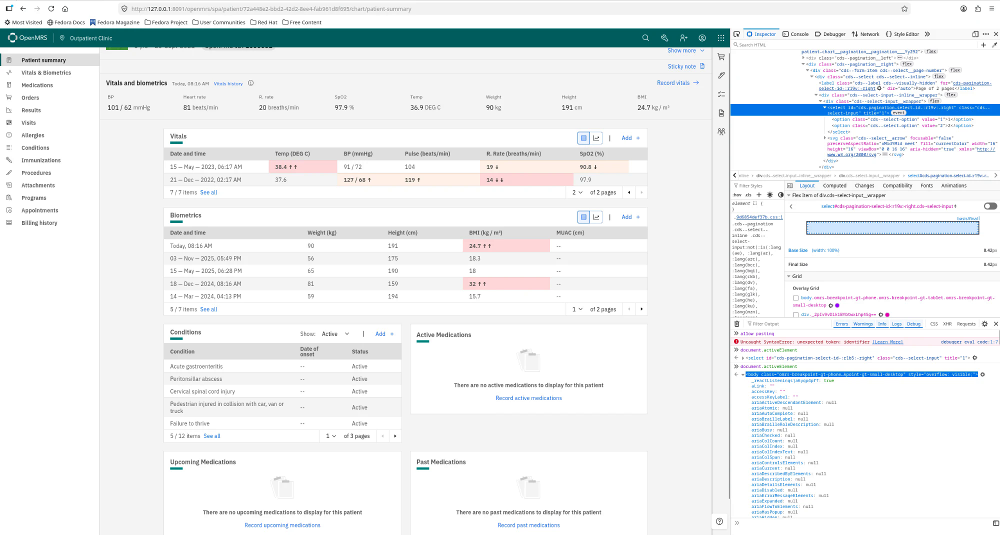
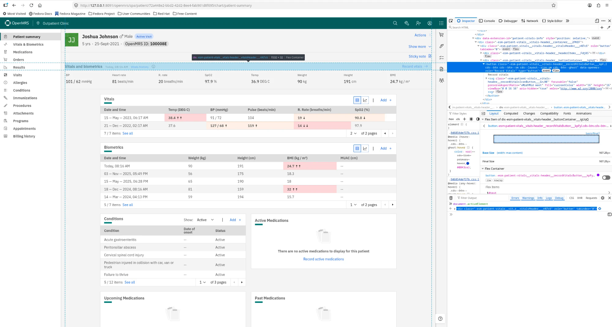
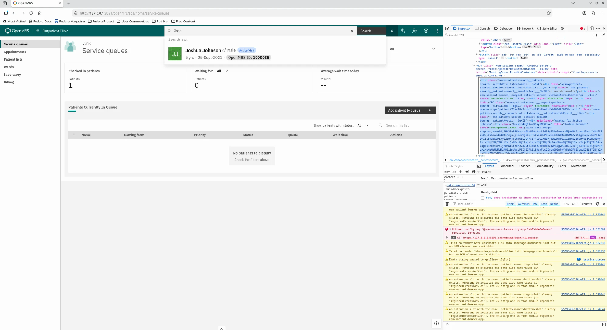
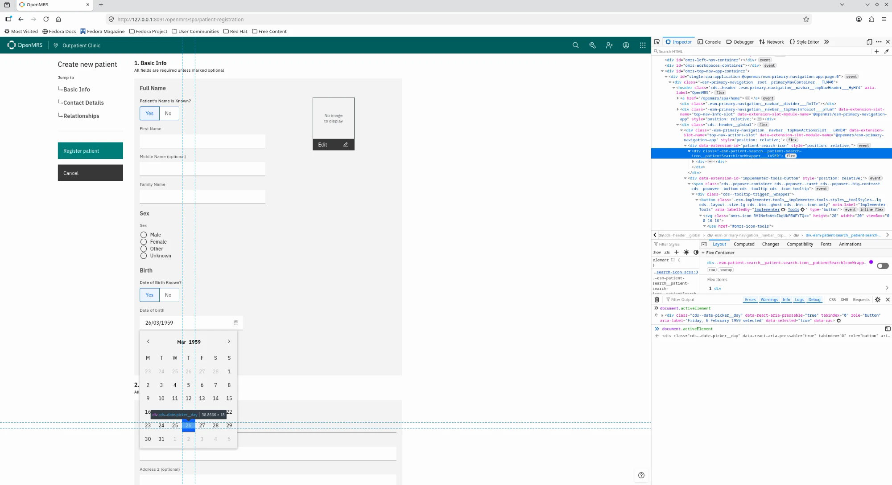
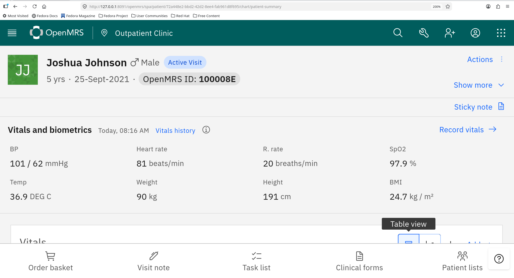
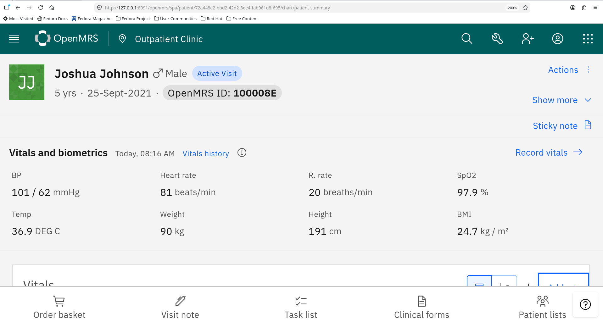
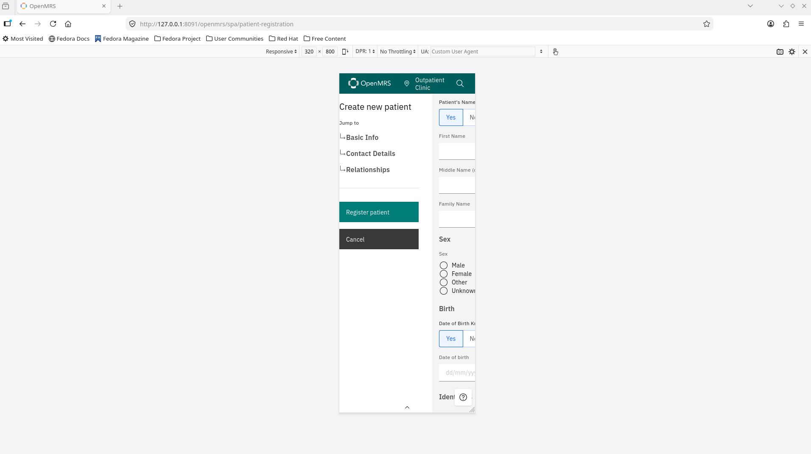
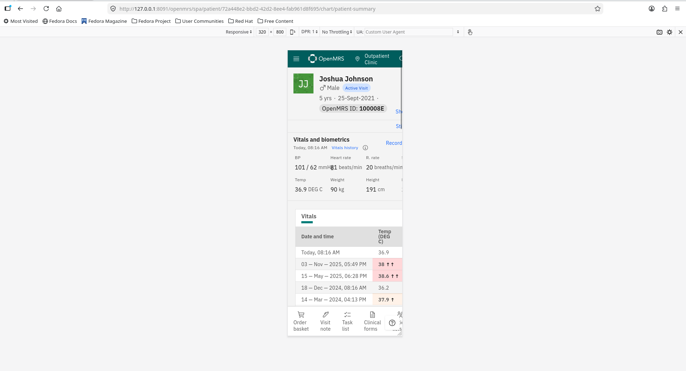
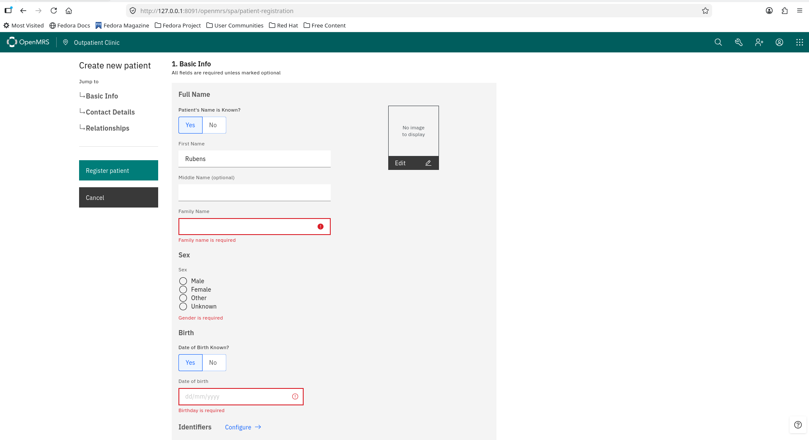

# Accessibility audit: OpenMRS O3 Reference Application 3.7.1

**Standard:** WCAG 2.2, Level AA · **Method:** WCAG-EM (sample-based) · **Date:** 7 October 2026
**Auditor:** Tayguara Dias Reis — Tech Lead, software quality (ISTQB CTFL)

> Independent assessment of open-source software, performed as a portfolio piece. It is
> not issued, reviewed or endorsed by the OpenMRS project. Findings describe the tested
> version and sample only; they are not a legal opinion or a certification.

## Executive summary

OpenMRS is an open-source electronic medical record system used by clinics and hospitals.
In the US, software like it falls under HHS Section 504 (compliance date 11 May 2027 for
recipients with 15+ employees), which requires WCAG 2.1 Level AA.

**Result: the sampled screens do not conform to WCAG 2.2 AA.** The audit found
**18 failures** (10 from automated scanning, 8 from manual testing) across
**11 success criteria**, 5 of them at Level A.

The most important pattern is about **keyboard focus**. Almost every function works with
a keyboard, but in four places the user cannot see where the focus is, or the focus is
lost or hidden:

- changing the page of a chart table throws the focus back to the top of the document (M1);
- the date-of-birth calendar can be operated with the arrow keys, but the selected day has
  no visible focus, so keyboard users can pick the wrong date without noticing (M5);
- at 200% zoom, a fixed bottom toolbar covers the focused controls (M6);
- a decorative container in the vitals card takes a Tab stop, does nothing and shows no
  focus (M2).

Two other findings have high impact for screen reader users: the patient search does not
announce how many results it found (M3), and every screen has the same page title,
"OpenMRS" (M8). At 320 px wide, the patient registration form cannot be used (M7).

**Good news for remediation:** two failures come from global components and appear on
every screen (A2, and A1, which is already fixed in the current source), and most focus problems share one root cause. A consistent
`:focus-visible` style, `scroll-padding` for the fixed bars and a handful of one-line
attribute fixes would resolve about half of the findings.

## 1. Scope and method

| Item | Value |
| --- | --- |
| System | OpenMRS O3 Reference Application **3.7.1** (official Docker images, pinned) |
| Environment | Local instance with the distribution's demo data |
| Standard | WCAG 2.2 Level AA (includes the WCAG 2.1 AA baseline required by ADA Title II and HHS 504) |
| Browsers | Chromium (Playwright 1.63), Firefox and Chrome on Linux, Chrome on Android |
| Assistive technology | Orca + Firefox (Linux), TalkBack + Chrome (Galaxy S22, Android) |
| Automated engine | axe-core 4.13.0 with the `wcag2a`, `wcag2aa`, `wcag21a`, `wcag21aa` and `wcag22aa` rule sets |
| Dates | 7 October 2026 |

**Why a local instance:** the public demo is behind Cloudflare bot protection, which blocks
automated scanning. A local, pinned instance also makes the audit reproducible.

### Sample (WCAG-EM steps 2 and 3)

| ID | Screen | Why it is in the sample |
| --- | --- | --- |
| P1 | Login | Entry point; WCAG 2.2 criterion 3.3.8 |
| P2 | Location picker | Mandatory step after login |
| P3 | Home (service queues) | Most used screen; tables and filters |
| P4 | Patient search and results | Dynamic results, status messages |
| P5 | Patient registration | Long form: labels, errors, date input |
| P6 | Patient chart — summary | Dense layout, paginated tables, fixed header |
| P7 | Patient chart — vitals form | Side panel (workspace), focus on open/close |
| P8 | Appointments | Calendar and filters; target size |

Two **complete processes** were tested end to end, because WCAG requires a process to
conform from start to finish:

- **Process A:** log in → choose location → register a patient (P1, P2, P5).
- **Process B:** search a patient → open the chart → record vitals (P4, P6, P7).

### Severity

| Severity | Meaning |
| --- | --- |
| **High** | Blocks a task or makes errors likely for some users |
| **Medium** | Task is possible but significantly harder, or information is lost |
| **Low** | Friction or non-conformance with limited impact |

## 2. Results by success criterion

| Criterion | Level | Result | Findings |
| --- | --- | --- | --- |
| 1.3.1 Info and Relationships | A | Fails | A2 |
| 1.4.1 Use of Color | A | Fails | A5 |
| 1.4.3 Contrast (Minimum) | AA | Fails | A4 |
| 1.4.10 Reflow | AA | Fails | M7 |
| 2.4.2 Page Titled | A | Fails | M8 |
| 2.4.3 Focus Order | A | Fails | M1 |
| 2.4.7 Focus Visible | AA | Fails | M2, M5 |
| 2.4.11 Focus Not Obscured (Minimum) | AA | Fails | M6 |
| 2.5.8 Target Size (Minimum) | AA | Fails | A7, A8 |
| 4.1.2 Name, Role, Value | A | Fails | A1, A3, A6, A9, A10, M2, M4 |
| 4.1.3 Status Messages | AA | Fails | M3 |

Criteria verified without failures in the sample are listed in section 4. The full,
criterion-by-criterion view is in the [Accessibility Conformance Report](acr.md).

## 3. Findings

### 3.1 Manual testing

#### M1 — Focus is lost when changing the page of a chart table
**2.4.3 Focus Order (A) · P6, P7 · Severity: Medium**

On the chart widgets (Vitals, Biometrics, Conditions), changing the page with the page
selector (arrow keys, Space and Enter) re-renders the table and the keyboard focus falls
back to `<body>`. Keyboard and screen reader users lose their place on a long page.

*Evidence:* `document.activeElement` is the page `<select>` before the change and
`<body>` after it. The select's `id` changes (`:r1b5:` → `:r19v:`), which shows the
element is re-created, not updated.



*Fix:* keep the same pagination instance across renders (stable `key`), or move focus
back to the selector after the page changes.

#### M2 — A container in the vitals card takes focus, does nothing and shows no focus
**2.4.7 Focus Visible (AA) and 4.1.2 Name, Role, Value (A) · P6, P7 · Severity: Medium**

In the sequence Show more → Sticky note → next Tab, focus lands on the vitals card header
before reaching "Record vitals". The header is a `div` with `role="button"` and
`tabindex="0"`: it is announced as a button, has no visible focus, Enter does nothing,
Space scrolls the page, and a mouse click does nothing either. It is a dead Tab stop.
Neighbouring controls ("Sticky note") show a clear focus outline. This is the same element
as automated finding A6 (nested interactive controls).



*Fix:* remove `role="button"` and `tabindex="0"` from the container. If it needs an action,
make it a real `<button>`, separate from the controls inside it, with a visible focus style.

#### M3 — Patient search does not announce the number of results
**4.1.3 Status Messages (AA) · P4 (global search panel) · Severity: Medium**

The "N search results" counter updates on every keystroke, but it is a plain
`<p class="…resultsText…">` with no `aria-live` or `role="status"` on it or on its
containers. Screen reader users do not learn whether the search found anyone without
leaving the field to check. Tested with TalkBack: typing works and the list updates
visually, but the count is not clearly announced.



*Fix:* render the counter inside an element with `role="status"` (or
`aria-live="polite"`) that already exists in the DOM before the first search.

#### M4 — A button nested inside a link in search results
**4.1.2 Name, Role, Value (A) · P4 (global search panel) · Severity: Medium**

Each search result is a link to the patient chart (`<a href="…/chart/">`) that contains a
button: the "Active Visit" tag, which opens a toggletip. Interactive content inside a link
is invalid HTML, and screen readers handle it inconsistently (the button may be hidden,
or the link name may include the button text).

*Fix:* move the tag out of the link, or render it as a non-interactive label inside
search results.

#### M5 — Calendar days have no visible focus
**2.4.7 Focus Visible (AA) · P5 (date of birth) · Severity: High**

Typing the date in the dd/mm/yyyy segments works. In the calendar pop-up, Tab moves through
"<", the year and ">", and the next Tab moves focus into the grid of days, but the focused
day has no visible indicator. The arrow keys move the selection and change the value of
the field, and Enter confirms, all without visual feedback. During testing the grid
seemed not to respond; in fact it was being navigated blindly, and the date
changed from 06/02/1959 to 26/03/1959 without the user seeing why. The calendar trigger
button also receives focus without an indicator.

*Evidence:* after the Tab, `document.activeElement` is
`<div class="cds--date-picker__day" role="button" tabindex="0" aria-label="Friday, 6 February 1959 selected">`;
after arrow keys and Enter it is "Thursday, 26 March 1959 selected".



*Fix:* add a `:focus-visible` (or `[data-focus-visible]`) style to calendar days and to the
trigger button, with a 2 px outline and at least 3:1 contrast. In a medical record, a
silently wrong date of birth is a data-quality risk, which is why this is rated High.

#### M6 — At 200% zoom, the fixed bottom toolbar hides the focused control
**2.4.11 Focus Not Obscured (Minimum) (AA) · P6 at 200% zoom · Severity: Medium**

At 200% zoom the chart switches to its tablet layout: the left menu becomes a hamburger
menu and the chart actions become a toolbar fixed to the bottom of the screen. Moving
forward with Tab, the controls of the Vitals card (table view toggle, "Add", and the
following ones) receive focus behind that toolbar: first partly, then completely hidden.
The page does not scroll, because for the browser the element is already inside the
viewport. Without zoom the same path passes, because the bottom toolbar does not exist in
the desktop layout. Zoom users often have low vision, the group that depends most on
seeing the focus.




*Fix:* set `scroll-padding-bottom` (and `scroll-padding-top`) on the scroll container to the
height of the fixed bars, so the browser scrolls focused elements clear of them.

#### M7 — Content is cut off at 320 px wide; registration cannot be completed
**1.4.10 Reflow (AA) · P5, P6 at 320 px · Severity: High**

At 320 CSS pixels (equivalent to 1280 px at 400% zoom) there is no horizontal scrollbar,
but content that does not fit is **clipped** with no way to reach it:

- **Registration:** the two-column layout does not stack. The "Jump to" menu and the
  action buttons take two thirds of the width; the form is squeezed and cut (labels cut in
  half, the "No" button and the inputs cut, the date field unreadable, the help button over
  "Identifiers"). The form cannot be completed at this width.
- **Chart:** the top bar icons, "Show more", "Sticky note", "Record vitals", the right
  column of the vitals summary (SpO2, BMI) and "Patient lists" in the bottom toolbar are
  cut; in the summary, values overlap ("mmHg" over "81 beats/min").

Data tables with their own horizontal scroll would be an allowed exception; these are not
tables.




*Fix:* stack the "Jump to" menu and buttons above the form on narrow screens; let the
patient header and action rows wrap; make the vitals summary a single column below about
480 px; move overflow icons from the top bar into the menu; reserve space for the help
button above the bottom toolbar.

#### M8 — Every screen has the same page title
**2.4.2 Page Titled (A) · All screens (P1–P8) · Severity: Medium**

All eight screens have `<title>OpenMRS</title>`. Screen reader users hear the title first
when a page loads and use it to tell browser tabs apart; with identical titles they cannot
tell the login, a patient chart or the registration form apart without exploring the page.

*Evidence:* the `title` recorded for each screen in the automated scan results.

*Fix:* set the document title per route, for example "Joshua Johnson — Patient chart —
OpenMRS" or "Register patient — OpenMRS".

### 3.2 Automated scanning (axe-core 4.13.0)

| Screen | Violations (rules) | Items needing manual review |
| --- | --- | --- |
| P1 Login | 0 | 1 |
| P2 Location picker | 1 | 0 |
| P3 Home (service queues) | 3 | 15 |
| P4 Patient search | 4 | 14 |
| P5 Patient registration | 4 | 15 |
| P6 Patient chart — summary | 6 | 54 |
| P7 Patient chart — vitals form | 5 | 52 |
| P8 Appointments | 5 | 14 |

The violations are not independent: two come from global components and repeat on almost
every screen.

| ID | Criterion | Level | Where | What happens | Suggested fix | Severity |
| --- | --- | --- | --- | --- | --- | --- |
| A1 | 4.1.2 Name, Role, Value | A | **Global** (P2–P8) | The help button (bottom right) has no accessible name; screen readers announce only "button" | `aria-label="Help"` on the help menu button | Medium |
| A2 | 1.3.1 Info and Relationships | A | **Global** (P3–P8) | User menu: the `<ul>` has `<div>` children, and the `<li>` items end up outside a valid list | Render each extension inside an `<li>`, or remove the wrapping `<div>` | Low |
| A3 | 4.1.2 Name, Role, Value | A | P4 | The refine-search form uses `role="refine-search"`, which is not an ARIA role | Remove the role (or use `role="search"`) | Low |
| A4 | 1.4.3 Contrast (Minimum) | AA | P5 | The dd/mm/yyyy placeholders of the date of birth have **1.72:1** contrast (`#c5c5c5` on white; 4.5:1 required) | Darken the date picker placeholder token | Low |
| A5 | 1.4.1 Use of Color | A | P6 | The "See all" links differ from the surrounding text only by colour, at **1.55:1** between them (3:1 required) | Underline the links or raise the contrast | Low |
| A6 | 4.1.2 Name, Role, Value | A | P6, P7 | The vitals card header is a `div role="button"` that contains a link and buttons (nested interactive controls); see M2 | See M2 | Medium |
| A7 | 2.5.8 Target Size (Minimum) | AA | P6, P7 | "Vitals history" is 16 px tall; "View normal ranges" is 16×16 px (24×24 px or equivalent spacing required) | Enlarge the clickable area with padding | Low |
| A8 | 2.5.8 Target Size (Minimum) | AA | P8 | The day and month segments of the date picker are 16×18 px | Same padding fix in the date component | Low |
| A9 | 4.1.2 Name, Role, Value | A | P8 | Two filter dropdowns have `aria-labelledby` pointing to empty labels | Fill the label or add `aria-label` | Medium |
| A10 | 4.1.2 Name, Role, Value | A | P8 | The batch-actions bar has `aria-hidden="true"` but contains focusable elements: keyboard users reach controls that screen readers do not announce | Use `inert` (or `hidden`) while the bar is hidden | Medium |

**Items the tool could not decide** (counted across all screens, to be reviewed manually in
a full audit): text contrast over coloured or gradient backgrounds (76, mostly the alert
colours in the vitals tables), ARIA attributes that may be prohibited or invalid (87, mostly
from the same components), one table header without data cells (the empty service queue),
and the bypass-blocks check on the login page.

### 3.3 Status on the current source code

Each finding was checked against the `main` branch of the three OpenMRS frontend
repositories on 7 October 2026 (details, permalinks and code quotes in
[source-verification.md](source-verification.md)):

| Status on `main` | Findings |
| --- | --- |
| **Fixed and released** | A1 (help button now has `aria-label="Help menu"`, esm-core v11.0.0, 6 Oct 2026) |
| **Fixed, not yet released** | A3 (invalid role replaced; fix merged after the latest patient-management release) |
| **Still present** | A2, A5, A6/M2, M3, M4, M5 (calendar days), M6, M8 |
| **Needs a runtime re-test** | M1 (the source shows no forced re-mount of the pagination; the focus loss may come from the Carbon component) |

The source review also explains M2: the vitals header has an `onClick` that toggles a
state no other code reads, so the "button" has no effect even with a mouse. Two further
observations from the source, not tested at runtime: each patient card in the full-page
search uses `role="banner"` (likely several banner landmarks on one page), and the search
loading skeletons use `role="progressbar"` without an accessible name.

## 4. Verified without failures

| Check | Criterion | Result |
| --- | --- | --- |
| Tab and Shift+Tab through the chart without zoom: the focused element stays visible behind the fixed top bar and help button | 2.4.11 | Passes |
| Zoom to 200% on registration, search and chart: content reflows into one column, nothing cut or overlapping | 1.4.4 | Passes |
| Submitting the empty registration form: submission is blocked, focus moves to the first empty required field, errors are given in text next to each field | 3.3.1 | Passes |
| Error text is programmatically tied to the field: `aria-invalid="true"` and `aria-describedby="familyName-error-msg"` | 3.3.1, 4.1.2 | Passes |
| Calendar pop-up: Esc closes it and Tab leaves it | 2.1.2 | Passes |
| Typing in the search field with TalkBack: letters are entered, focus stays in the field, no unexpected context change | 3.2.2 | Passes |
| The help button is in the same place on every screen | 3.2.6 | Passes |



**Recommendations that are not failures:**

- The yellow error toast disappears on its own. The same errors stay next to each field, so
  no information is lost (2.2.1 does not apply), but the toast is the only summary of all
  errors; keep it until the user dismisses it.
- The same field has different names in its label, its error and the toast: "Date of birth"
  / "Birthday is required" / "birthdate", and "Sex" / "Gender is required". Use the visible
  label in error messages.
- On repeated submits, two "Please fill out this field." bubbles overlap and the toasts pile up.

**Not an OpenMRS failure:** with Orca and Firefox, typing in the global search stopped
after the first letter. The same test passed with TalkBack, so it was recorded as an Orca
limitation.

## 5. Remediation roadmap

| Priority | Action | Fixes | Effort |
| --- | --- | --- | --- |
| 1 | Consistent `:focus-visible` style in the design system, including calendar days and icon buttons | M2, M5 | Small |
| 2 | `scroll-padding` on the scroll container for the fixed top and bottom bars | M6 | Small |
| 3 | `role="status"` around the search results count | M3 | Small |
| 4 | Per-route document titles | M8 | Small |
| 5 | One-line attribute fixes: help button name, invalid role, empty labels, `inert` for hidden bars | A1, A3, A9, A10 | Small |
| 6 | Stable pagination instance, or focus restored after page change | M1 | Small–medium |
| 7 | Remove the fake button around the vitals header; take the tag out of search result links | M2/A6, M4 | Medium |
| 8 | Responsive fixes for 320 px: registration layout first, then chart header and vitals summary | M7 | Medium |
| 9 | Contrast and target size adjustments in the design tokens | A4, A5, A7, A8 | Small |

After remediation, an automated accessibility check in CI (for example axe-core with
Playwright on the main flows) keeps these fixes from regressing release after release.

## 6. Limitations

- **Sample, not full coverage.** Eight screens and two processes. Other modules (orders,
  laboratory, billing, wards, forms) were not tested.
- **Assistive technology coverage.** NVDA and JAWS (Windows) and VoiceOver (iOS, macOS),
  the most used screen readers in the US, were not tested in this round. Semantic findings
  (M3, M4, M8) were confirmed from the code; screen reader behaviour is limited to Orca and
  TalkBack.
- **Version.** Findings refer to 3.7.1. Section 3.3 gives their status on the current
  source code; A1 and A3 are already fixed there.
- **Demo data.** One demo visit was created through the REST API to reach the vitals form.

## 7. How to reproduce

```bash
cd audits/2026-10-openmrs-o3/scan
docker compose up -d     # OpenMRS 3.7.1 on http://127.0.0.1:8091/openmrs/spa (first start: up to ~1 h)

cd ../../../tools/axe-scan
npm ci
npm run login -- http://127.0.0.1:8091/openmrs/spa/login   # log in, pick a location, close the window
node scan.mjs ../../audits/2026-10-openmrs-o3/scan/pages.json --auth .auth/state.json
```

The login uses the distribution's default demo credentials from the OpenMRS documentation.
The session is stored in `.auth/` (ignored by git) and expires after about 30 minutes of
inactivity. The P7 page needs an active visit for the patient in `pages.json`.
